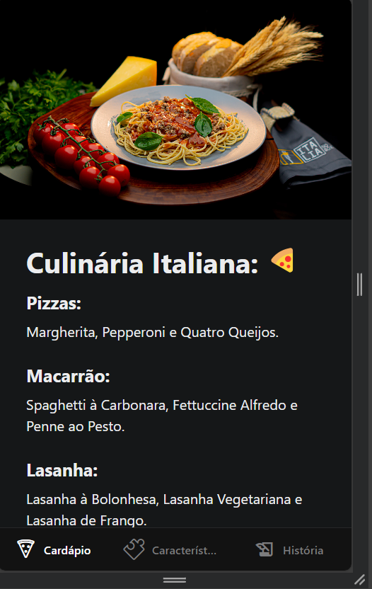
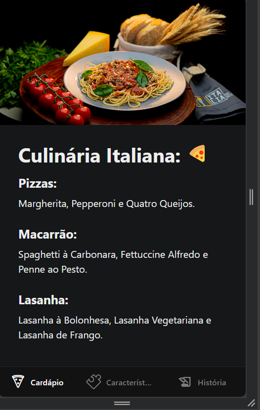
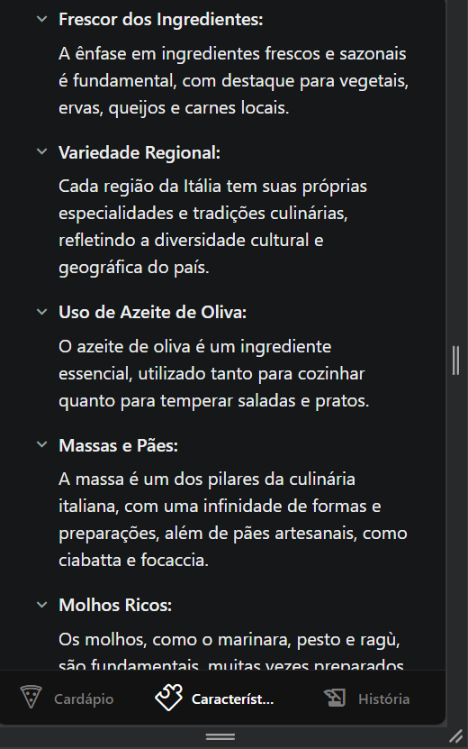
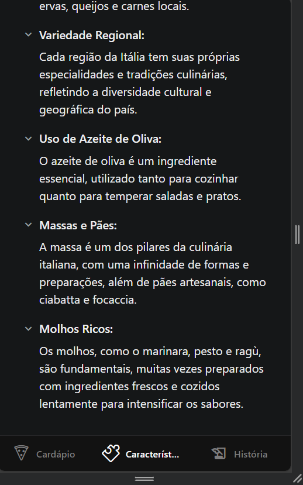
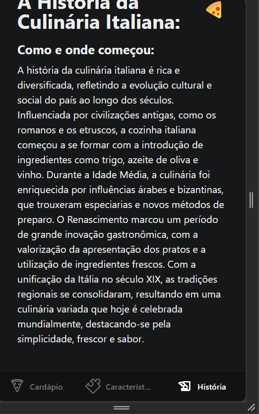

# trabalho-mobile-mayara - Comidas Italianas
Este é um aplicativo simples desenvolvido com React Native que consome uma API de curiosidades italianas, exibe uma lista de pratos, e permite explorar a culinária da Itália diretamente do seu dispositivo móvel.

## Aba 1 - Cardápio Italiano
- Exibe uma lista de pratos italianos
- Mostra opões de sabores de cada prato
- Interface simples e intuitiva.

## Aba 2 - Características da Culinária Italiana
- Exibe uma lista de características
- Possui collapsibles que explicam as características

## Aba 3 - A Histólia da Culinária Italiana
- Mostra um resumo da origem da culinária italiana

## Tecnologias Utilizadas
- **React Native**: Framework para o desenvolvimento de aplicativos móveis nativos.
  
## Capturas de Tela

Abaixo estão algumas capturas de tela do aplicativo:

1. **Tela Inicial - Cardápio Italiano**
   
   
   

2. **Características da Culinária Italiana**
   

   

   

3. **História da Culinária Italiana**
   

   